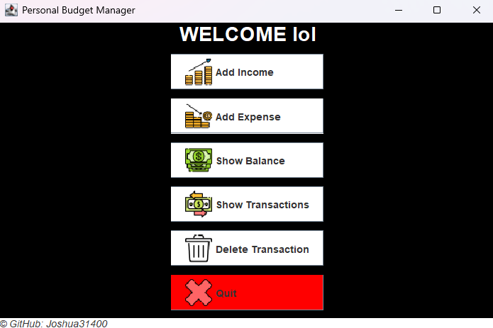

# JAVA WALLET

---
## 📖 Table of contents

1. [**📚 About the project**](#-about-the-project)
2. [**🚀 How to run the project**](#-how-to-run-the-project)
3. [**💻 Technologies**](#-technologies)
4. [**🎥 Demo**](#-demo)
5. [**👥 Credits**](#-credits)

---
## 📚 About the project

This project was developed during a POO cours, by Ynov Campus. The goal was to learn basic Java concepts.

The application is a wallet manager that allows users to manage their finances. Users can add, remove, and view transactions, as well as see the history of their transactions. The application supports both income and expense transactions, providing a clear overview of the user's financial status.  

The final project repository can be founded [here](https://github.com/Joshua31400/java-wallet.git)

---
## 🚀 How to run the project

To run the project, you will need to have JDK installed on your computer. If you don't have it, you can download it [here](https://www.oracle.com/java/technologies/downloads/).

1. Clone the repository and navigate to the project directory:
```  
git clone https://github.com/Joshua31400/java-wallet.git
cd java-wallet
```

2. Compile the project and run project:  
```
Clique on run button in your IDE
```

---
## 💻 Technologies


---
## 🎥 Demo



---
## 👥 Credits

This project was developed by:

<a href="https://github.com/joshua31400"></a>